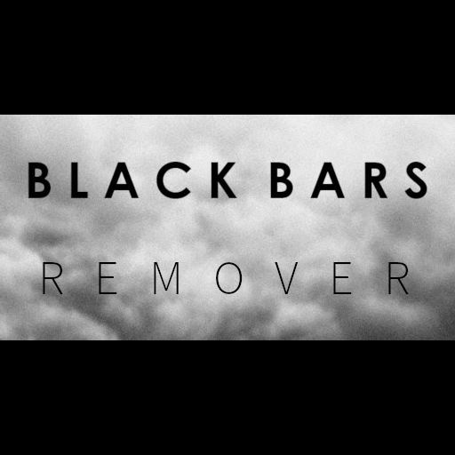

# Introduction

Black Bars Remover is a simple addon for Kodi which allows automatic scaling/fitting the playing video to your screen height, eliminating all black bars.
This also takes Kodi's "minimise black bars" setting into consideration. It only zooms the correct amount without overscaling.

# Requirements

* Since version 2.0.0, this addon requires at least Kodi version 18.2 (Leia).
* Since version 3.0.0, this addon requires at least Kodi version 19 (Matrix).

If you are still using an older Kodi version, please use the (non-automatic) addon version 1.x.x.

# Installation

Go to the releases page and download an addon zip or get the [master branch](https://github.com/milaq/kodi_addon_blackbarsremover/archive/master.zip) version and place it on your Kodi machine. You can then install it by using the "install from zip file" option.

# Configuration

If enabled, the addon automatically adjusts the zoomlevel when a video is playing.
It will adjust the zoom to fit the screen up to the configured maximum compensation value.

The addon settings allow you to configure the maximum amount of automatic zoom and optional additional zoom compensation.
